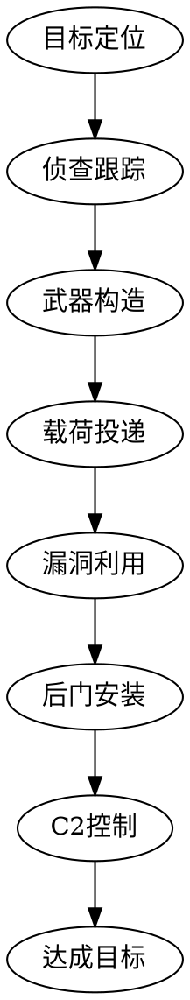

## 摘要

>情报工作的最终目标是更好地理解和防御对手。

<!--more-->

>Many intelligence reports in war are contradictory;even more are false,and most are uncertain. -- Carl von Clausewitz

## Introduction to Intelligence

情报的基本假设是：从各种来源获取外部信息，并根据现实要求进行分析，最终提供能影响决策的评估。这个过程会发生在个人层面或更高层，在机构层面、公司层面以及政府层面每一天都在上演。

## 情报级别

#### 战术情报

#### 作业情报

#### 战略情报

>"战略并不是一个真正的计划，而是一个推动计划的逻辑。" —— John G. Heidenrich

Strategic Intelligence. A renowned expert in strategic intelligence matters, John G. Heidenrich has long advocated an analytical approach that is “holistic” (comprehensive) by assessing the interactions of political, military/security, socio-cultural, economic, technological, and environmental variables.

约翰·海登里奇(John G. Heidenrich)是战略情报方面的著名专家, 他长期以来一直主张采取 “holistic” (comprehensive)  "整体" (全面) 的分析方法, 评估政治、军事安全、社会文化、经济、技术、和环境变量。

## 情报来源

#### 人工情报 HUMINT

人工情报是情报收集最古老的形式。

#### 信号情报 SIGINT

#### 公开情报 OSINT

#### 图像情报 IMINT

#### 测量与特征情报 MASINT

#### 地理空间信息情报 GEOINT

#### 其它概念

- 网络情报（CYBINT）主要来源于 ELINT 和 SIGINT
- 技术情报（TECHINT）
- 金融智能（FININT）

## 情报周期

#### 方向（Direction）

#### 收集（Collection）

- 地缘政治来源
- 经济来源
- 历史来源
- 业务来源

#### 处理（Processing）

- 正规化（Normalization）
- 索引（Indexing）
- 翻译（Translation）
- 拓线（Enrichment）: 为一条信息提供额外的元数据
- 过滤（Filtering）
- 优先级（Prioritization）
- 可视化（Visualization）

#### 分析（Analysis）

- 置信级别

谢尔曼·肯特（Sherman Kent）被很多人称为情报分析之父，他在1964年写了一篇名为“Words of Estimative Probability”的文章，其中描述了各种定性方式来描述分析师对置信级别的判断。

在所有的重要分析中，分析员(或者外部专家)必须就其对所表达判断的信心水平进行全面评估和明确表态。

>起初分析员的信心水平很低，但几个月后，他们的信息水平就很高了。决策者非常清楚分析员在这个问题上的观点发生了变化。—— 《不完美风暴》p117

- **量化那些无法量化的内容**

| 概率 | 估计词汇   | 估计词汇             | 偏差区间     |
| ---- | ---------- | -------------------- | ------------ |
| 100% | 确定       | Certainty            |              |
| 93%  | 几乎确定   | Almost certain       | 上下浮动 6%  |
| 75%  | 可能       | Probable             | 上下浮动 12% |
| 50%  | 一半可能   | Chances about even   | 上下浮动 10% |
| 30%  | 大概不是   | Probablly not        | 上下浮动 10% |
| 7%   | 几乎不可能 | Almost certainly not | 上下浮动 5%  |
| 0%   | 不可能     | Impossibility        |              |

#### 传播（Dissemination）

#### 反馈（Feedback）

## 情报机构

##### 美国网络战司令部

美国网络作战司令部（United States Cyber Command,USCYBERCOM）。前身：计算机网络防御联合特遣部队（JTF-CND）

##### 美国陆军行为与社会科学研究学院

##### 信息共享和分析中心 ISACs

信息共享和分析中心（Information Sharing and Analysis Center，ISACs）

## 情报规范

没有合适受众的情报不是好情报。

#### 美军《Joint Publication 2-0》

- [《Joint Publication 2-0 : Joint Intelligence》](https://www.jcs.mil/Portals/36/Documents/Doctrine/pubs/jp2_0.pdf)

#### 英军《Joint Doctrine Publication 2-00》

- [Understanding and intelligence support to joint operations (JDP 2-00)](https://www.gov.uk/government/publications/jdp-2-00-understanding-and-intelligence-support-to-joint-operations)

## Tool & Technology

#### 竞争性假设分析 ACH

竞争性假设分析(Analysis of Competing Hypotheses,ACH)是 CIA 使用30年以上的研究方法论，ACH 帮助面对巨大量数据和假设条件时，进行有逻辑性的分析，指导研究人员识别争论的焦点，进行富有成效的讨论。

竞争性假设分析法强制分析人员考虑全部可能性，而不是凭直觉挑出来某一假设，再找证据支持这一假设。

#### 杀伤链 Kill Chains

- Eric M. Hutchins（Lockheed Martin 公司）:"Intelligence-Driven Computer Net-work Defense Informed by Analysis of Adversary Campaigns and Intrusion Kill Chains"

## 人物

#### Richard Heuer

Richard Heuer 在 CIA 工作45年，在竞争性假设分析领域成果卓著（Analysis of competing hypotheses），被称为 "情报之父"。

- 《情报分析心理学》（The Psychology of Intelligence Analysis,2010）
- 《Structured Analytic Techniques for Intelligence Analysis》（ 2010年，与Randolph（Randy）H. Pherson 共同撰写）

#### 谢尔曼·肯特（Sherman Kent）

谢尔曼·肯特（Sherman Kent）被很多人称为情报分析之父。

- 耶鲁大学历史学博士
- 二战时期，加入美国政府战略服务办公室（OSS）的下属机构 —— 研究与分析部门（ R & A ）。该部门包括经济学家、科学家和军事人员，职责不包括制定战术行动计划，而是重点分析对手的基础和运行环境，例如文化、食品、财政和运输，以帮助确定哪些行动将对国家战略产生最重大的影响。他们提供的战略情报不仅有助于完成一项任务，而且有助于整个战争。
- 1964年，“Words of Estimative Probability”

#### John Heidenrich

- Paper [The State of Strategic Analysis](https://www.cia.gov/library/center-for-the-study-of-intelligence/csi-publications/csi-studies/studies/vol51no2/the-state-of-strategic-intelligence.html)

## 扩展阅读

- [情绪的动物：认知、偏见与决策](http://riboseyim.github.io/2019/02/10/Psychology-Biases/)
- [如何作出正确决策](https://riboseyim.github.io/2018/12/31/Intelligence-Decision/)
- [行走的思想家:罗伯特·D.卡普兰](https://riboseyim.github.io/2019/03/17/International-Relations-Kaplan/)
- [国之重器，在人不在宝 | 挑战者号航天飞机事故调查](https://riboseyim.com/2019/02/04/Engineering-Ethics/)
- [红楼故事：康熙的秘密情报系统](https://riboseyim.github.io/2018/02/04/Redology-Intelligence/)

## 荐书

##### 《不完美风暴》
- Title: 美国中央情报局反恐30年
- Author: 迈克尔·莫雷尔（Michael Marell）
- Author: 比尔·哈罗（Bill Harlow）

##### 《情报分析心理学》
- Title: The Psychology of Intelligence Analysis
- Author: Richard Heuer

##### 《Incident Response & Computer Forensics》(入侵调查)
- Author: McGraw-Hill
- 2014年 Third Edition

##### 《情报驱动应急响应》
- Title:Intelligence-Driven Incident Response:Outwitting the Adversary
- Author: Scott J. Roberts
- Author: Rebekah Brown

##### 《如何作出正确决策》
- 作者：加里·克莱因
- 如何作出正确决策:直击决策真相，揭秘是什么在影响你作决定
- 中国青年出版社

## 参考文献
