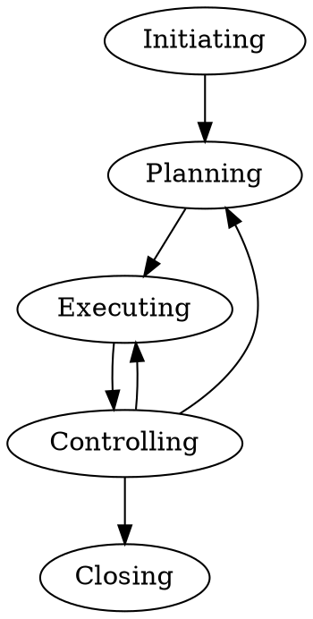

## 摘要

- PMI 项目管理知识体系

<!--more-->

美国项目管理协会（Project Management Institute，简写 PMI）成立于1969年，是一个由项目管理专业领域内的研究人员、学者、顾问和经理组成的全球性的专业组织机构。PMP(Project Management Professional)是该协会推出的资格认证。

## 引论 | Introduction

#### 项目的三重制约（triple constraint）

在实际的项目管理中，三重制约各要素的优先权不同。

|        |        |
| ------ | ------ |
| S 范围 | S 范围 |
| T 时间 | T 时间 |
| Q 质量 | Q 质量 |
| C 成本 | C 费用 |
|        | R 资源 |
|        | R 风险 |

#### 目标管理（MBO,Management by Objectives）

实施目标管理的三个步骤：

1）树立目标（SMART）

- 具体的 Specific
- 可衡量的 Measurable
- 可达到的 Achievable
- 现实的 Realistic
- 基于时间的 Timebased

2）定期评估目标可否达到
3）采取修正措施

#### 项目管理环境

- 项目组合 Portfolios : 战略业务目标，相互无关
- 项目集 Programs : 相互关联
- 项目 Project

* 组织级项目管理（OPM）

#### 项目管理逻辑过程

项目管理逻辑过程（ITTO）:

- 输入 Input
- 工具与技术 Tool & Technology
- 输出 Output

#### 项目管理生命周期

五大项目管理过程组：启动、规划、执行、监控、收尾。

项目管理过程组 | Project Management Process Groups

- 启动过程组 | Initiating Process Group
- 规划过程组 | Planning Process Group
- 执行过程组 | Executing Process Group
- 监控过程组 | Monitoring and Controlling Process Group
- 收尾过程组 | Closing Process Group

#### PMP 知识框架

| 知识领域           | 启动过程组       | 规划过程组                                                                                                             | 执行过程组                                         | 监控过程组                                 | 收尾过程组         |
| ------------------ | ---------------- | ---------------------------------------------------------------------------------------------------------------------- | -------------------------------------------------- | ------------------------------------------ | ------------------ |
| 4. 项目整合管理    | 4.1 制定项目章程 | 4.2 制定项目管理计划                                                                                                   | 4.3 指导与管理项目工作   4.4 管理项目知识       | 4.5 监控项目工作   4.6 实施整体变更控制 | 4.7 结束项目或阶段 |
| 5. 项目范围管理    |                  | 5.1 规划范围管理   5.2 收集需求   5.3 定义范围   5.4 创建WBS                                                  |                                                    | 5.5 确认范围   5.6 控制范围             |                    |
| 6. 项目进度管理    |                  | 6.1 规划进度管理   6.2 定义活动    6.3 排列活动顺序    6.4 估算活动持续时间    6.5 制定进度计划            |                                                    | 6.5 控制进度                               |                    |
| 7. 项目成本管理    |                  | 7.1 规划成本管理    7.2 估算成本    7.3 制定预算                                                                 |                                                    | 7.4 控制成本                               |                    |
| 8. 项目质量管理    |                  | 8.1 规划质量管理                                                                                                       | 8.2 管理质量                                    | 8.3 控制质量                               |                    |
| 9. 项目资源管理    |                  | 9.1 规划资源管理    9.2 估算活动资源                                                                                | 9.3 获取资源    9.4 建设团队    9.5 管理团队 | 9.6 控制资源                               |                    |
| 10. 项目沟通管理   |                  | 10.1 规划沟通管理                                                                                                      | 10.2 管理沟通                                      | 10.3 监督沟通                              |                    |
| 11. 项目风险管理   |                  | 11.1 规划风险管理    11.2 识别风险    11.3 实施定性风险分析    11.4 实施定量风险分析     11.5 规划风险应对 | 11.6 实施风险应对                                  | 11.7 监督风险                              |                    |
| 12. 项目采购管理   |                  | 12.1 规划采购管理                                                                                                      | 12.2 实施采购                                      | 12.3 控制采购                              |                    |
| 13. 项目相关方管理 | 13.1 识别相关方  | 13.2 规划相关方参与                                                                                                    | 13.3 管理相关方参与                                | 13.4 监督相关方参与                        |                    |

#### 变更控制系统

PMIS -> 配置管理 -> 变更控制

变更控制系统是配置管理系统的一个子系统，包括：

- 一份变更控制计划：包括在项目管理计划中。
- 组建 **变更控制委员会（CCB，change control board）** 批准所有的变更
- 变更控制流程（如何控制，谁负责）
- 变更表格 Change forms
- 报告Reports(里程碑图表，资源使用量)
- 绩效统计值

#### 项目成功

项目成功的判断标准：
- 按基准完成
- 在容忍范围内完成

## 项目运行环境 | The Environment in which Projects Operate

#### 事业环境因素 | Enterprise Environment Factors

#### 组织过程资产 | Organizational Process Assets

#### 组织结构类型

- 智能型组织（functional organization）
- 项目型组织（projectized organization）
- 矩阵型组织（Matrix organization）: strong vs balanced vs weak

- 协调员 Coordinator (决策)
- 联络员 Expediter （不决策）

#### 项目经理的角色 | The Role of The Project Manager

## 项目整合管理 | Project Integration Management

#### 制定项目章程

- 输入：商业文件（商业论证）、协议、事业环境因素、组织过程资产
- 工具与技术：专家判断、数据收集（头脑风暴、焦点小组、访谈）、人际关系与团队技能、会议
- 输出：项目章程、假设日志

#### 商业论证 Business Case

商业论证两大类别：
- 【数学法】Constrained optimization methods 约束优化法
- 【比较法】Benefit measurement methods 比较利益法

数学模型:
- 线性规划 Linear programming
- 整数规划 Integer programming
- 动态规划 Dynamic programming
- 多目标规划 Multi-objective programming

比较利益法：
- 项目谋杀会议 Murder board : 末位淘汰
- 同行评审 Peer review : 权责不一致
- 评分模型 Scoring models
- Q排序模型 Q-sort
- 经济学模型 Economic models

#### **选择项目 （￥￥￥）**

| 指标项                   | 含义                           | 对项目含义  |
| ------------------------ | ------------------------------ | ----------- |
| 项目优先级               | 项目重要程度代表获取资源的能力 |             |
| NPV（净现值）            |                                |             |
| IRR（内部收益率）        |                                |             |
| Payback Period（回收期） | 收回成本所需时间               |             |
| BCR（收益成本分析）      | Benefit(payback) / Cost        |             |
| ROI（投资利润率）        |                                |             |
| SV                       | 进度偏差                       | 0           |
| CV                       | 成本偏差                       | 0           |
| 工期绩效指数（SPI）      | EV/PV                          | >1 进度提前 |
| 成本绩效指数（CPI）      | EV/AC                          | >1 成本节约 |

- PV: Present Value 现值
- NPV: Net Present Value 净现值 ；净现值=收益现值-成本现值

#### 项目章程

#### **项目计划 （￥￥￥）**

- 基准（Baseline）
正式批准的项目管理计划成为基准，变更基准须提出变更请求并经实施整体变更控制过程批准。

项目管理计划特点：
- 正式 Formal
- 接受 Bought into
- 现实 Realistic
- 批准 Approved

#### 项目会议
- 开工会（Kickoff Meeting）: 规划结束，执行开始；PM和项目团队
- 启动会（Initial Meeting）: 启动过程中。客户、发起人、PM

#### 管理项目知识

- 项目文件

|                    |                                |
| ------------------ | ------------------------------ |
| 需求管理计划       | 需求文件                       |
| 进度管理计划       | 项目日志（记录问题、假设条件） |
| 成本管理计划       | 风险登记册                     |
| 质量管理计划       | 项目相关方登记册               |
| 人力资源计划       |                                |
| 沟通管理计划       |                                |
| 风险管理计划       |                                |
| 采购管理计划       |                                |
| 项目相关方管理计划 |                                |
| 项目基准           |                                |

- 经验教训登记册
形成时间、经验教训描述、形成原因、造成影响、解决办法

#### 监控项目工作

**Focus on Whom**

- 实际绩效：对比项目管理计划；评估是否需要纠正、预防措施
- 风险：识别、分析、跟踪和监测已有风险
- 信息库：文档
- 绩效报告：状态报告、进展测量和预测
- 监督变更实施情况

**监控分析技术**

- 回归分析：根本原因分析
- 分组方法：预测方法（如时间序列、情景构建、模拟等）
- **因果分析**
- 失效模式与影响分析（FMEA）
- 故障树分析（FTA）
- 储备分析
- 趋势分析
- 挣值管理
- 差异分析

#### 实施整体变更控制

**Never change is change**

永远不变的就是变化：
- 合理接受变更
- 严谨管理变更

## 项目范围管理 | Project Scope Management

## 项目进度管理 | Project Schedule Management

## 项目成本管理 | Project Cost Management

## 项目质量管理 | Project Quality Management

## 项目资源管理 | Project Resource Management

## 项目沟通管理 | Project Communications Management  

## 项目风险管理 | Project Risk Management  

## 项目采购管理 | Project Procurement Management  

## 项目相关方管理 | Project Stakeholder Management  

## 工具与技术
#### 垂直图表法

## 阅读作业

- 《PMBOK 项目管理知识体系指南》

#### 拓展阅读

- [项目管理 | Overview of Project Management](https://riboseyim.com/2019/02/06/Project/)
- [PM指南:PMI项目管理知识体系](https://riboseyim.com/2019/04/30/Project-PMP/)
- [PM指南:建筑工程项目管理|行业案例教学](https://riboseyim.com/2019/03/27/Project-Construction/)
- [PM指南:范围管理](#)
- [PM指南:进度管理](#)
- [PM指南:成本管理](#)
- [PM指南:质量管理](#)
- [PM指南:资源管理](https://riboseyim.github.io/2019/03/12/Project-Resources/)
- [PM指南:沟通管理](https://riboseyim.com/2019/02/06/Project-Communications/)
- [PM指南:风险管理](https://riboseyim.github.io/2018/06/05/Project-Risk/)
- [PM指南:采购管理](https://riboseyim.github.io/2019/03/12/Project-Procurement/)
- [PM指南:相关方管理](#)
- [PM指南:网络计划技术|工具与技术](https://riboseyim.com/2019/05/29/Project-Tech-NetworkPlanning/)
- [PM指南:项目管理信息系统|工具与技术](https://riboseyim.com/2019/04/06/Project-PMIS/)
- [PM指南:项目管理开局模板|工具与技术](https://riboseyim.com/2018/06/19/Project-Template/)
- [PM指南:开源项目管理平台Redmine|工具与技术](https://riboseyim.com/2016/04/26/TeamWork-Redmine/)
- [PM指南:软件业看板Kanban管理实践|工具与技术](https://riboseyim.com/2017/08/06/TeamWork-Kanban/)
- [PM指南:源代码版本管理|工具与技术](https://riboseyim.com/2016/05/31/TeamWork-Git/)

## 参考文献
