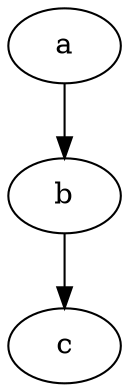

## 摘要
- 学习范式
- 写作范式
- 输出范式

>探索在本质上是分散行动，并通过一种可扩展的通信机制来协调整体行为。--《大教堂与集市》

<!--more-->

## 范式1：主题式

#### 1.1 主题式/推荐解决方案

```Markdown
## 摘要
<!--more-->

## Background
#### Question
#### Theory

## Introduction | XX简介

## Core Concept | 核心概念  

#### Concept A
#### Concept B
#### Concept C

## Architecture Overview
#### Files Tree

## Best Practice | XX 最佳实践

## Future：Beyond the XXX

## 阅读作业

## 拓展阅读

## 参考文献
```

#### 1.2 主题式/开放式解决方案

```Markdown
## 摘要
<!--more-->

## Background

#### Question

#### Overview Current Solutions

- solution 1. 利/弊
- solution 2. 利/弊
- solution 3. 利/弊

## Introduction XXXX Solution (New)

#### Overview of XXXX Theory

##### Concept A | 核心概念  
##### Concept B | 核心概念  
##### Concept C | 核心概念  

## Overview of XXXX Practice （最佳实践）

## Future：Beyond the XXX

## 阅读作业

## 拓展阅读

## 参考文献
```

## 范式2：网络协议

```Markdown
## XX 协议简介 | Introduction
- [RFC no](\#)
- [RFC no](\#)
## Core Concept | 核心概念
#### Concept A
#### Concept B
#### Concept C
## Architecture Overview
#### Files Tree
## Best Practice | XX 最佳实践
```

## 范式3：翻译文章

```Markdown

## Title

- 原标题：Seven Things to Know about Technical Writing at Uber
- 链接：[https://eng.uber.com/technical-writing-uber/]
- 作者：Shannon Brown
- 发表时间：October 3, 2018


```
## 范式4：系列文章

```Markdown
This article is part of an **Distributed Tracing and Monitoring System** tutorial series. Make sure to check out my other articles as well:

- [DevOps 漫谈：分布式追踪系统体系概要](https://riboseyim.github.io/2018/05/18/DevOps-OpenTracing/)
- [DevOps 漫谈：开源分布式跟踪系统 OpenCensus](https://riboseyim.github.io/2018/04/27/DevOps-OpenCensus)
```

## 范式5：书籍目录

```Markdown
# 情报驱动应急响应
- Intelligence-Driven Incident Response: Outwitting the Adversary
## 序言
## 前言
# 第一部分 基础知识
## 第 1 章 概述
#### 1.1.1 网络威胁情报的历史 History
#### 1.1.2 现代网络威胁情报
#### 1.1.3 未来之路 Future
#### 1.2 什么是情报驱动的事件响应 What
#### 1.4 为什么是情报驱动的事件响应 Why
## 第 2 章 情报原则
## 第 3 章 事件响应原则
# 第二部分 实战篇
## 第 4 章 查找
## 第 5 章 定位
## 第 6 章 消除
## 第 7 章 利用
## 第 8 章 分析
## 第 9 章 传播
# 第三部分 未来之路
## 第 10 章 战略情报
## 第 11 章 建立情报计划
# 附录

```

## 范式6：表格结构

| 项目  | 属性A | 属性B | 属性C |
| ----- | ----- | ----- | ----- |
| 数据1 |       |       |       |
| 数据2 |       |       |       |
| 数据3 |       |       |       |  


<table>
   <tr>
      <td>项目</td>
      <td>属性A</td>
      <td>属性B</td>
      <td colspan="2" align="center">属性C</td>
   </tr>
   <tr>
      <td><a href="https://riboseyim.com" target="\_blank">数据11</a></td>
      <td>数据12</td>
      <td>数据13</td>
      <td>数据14</td>
      <td>数据15</td>
   </tr>
   <tr>
      <td>数据21</td>
      <td>数据22</td>
      <td>数据23</td>
      <td>数据24</td>
      <td>数据25</td>
   </tr>
   <tr>
      <td rowspan="2">数据31</td>
      <td>数据32</td>
      <td>数据33</td>
      <td>数据34</td>
      <td>数据35</td>
   </tr>
   <tr>
      <td>数据42</td>
      <td>数据43</td>
      <td>数据44</td>
      <td>数据45</td>
   </tr>
</table>

## 范式7：树形结构

```bash
|—— root
|   |—— dir 2
|   |   |——dir 2-1
|   |   |——dir 2-2
|   |   |__dir 2-3
|   |—— dir 3
|   |   |——dir 3-1
|   |   |——dir 3-2
|   |   |__dir 3-3
|   |__ file.md
```

## 范式8：事件简报

```Markdown
# 事件名称

## 摘要

>a
>b
>c

## 时间线

- 2019-01-01 xxxxx
- 2019-01-11 xxxxx
- 2019-02-01 xxxxx

## 影响

## 意见建议

- 建议1
- 建议2
- 建议3

## 正在采取的行动

## 参考资料

```

## 范式9：研究课题

```Markdown
# 课题名称

## 摘要

>a
>b
>c

## 里程碑目标

- 2019-01-01 xxxxx
- 2019-01-11 xxxxx
- 2019-02-01 xxxxx

## 阅读作业

- 作业1
- 作业2
- 作业3

## 理论成果

- 成果1
- 成果2
- 成果3

## 工程实践

- 实践1
- 实践2
- 实践3

```

## 范式10：Flow Chart

#### 10.1 Flow Chart Dot



#### 10.2 Flow Chart Sequence

```sequence

participant 自然 as N

participant 科学 as S

participant 商业 as B

participant 工程 as E

participant 教育 as ED

participant 法律 as L

participant 公共 as P

participant 社会 as S

B->E:项目管理

```

#### 拓展阅读

- [项目管理 | Overview of Project Management](https://riboseyim.com/2019/02/06/Project/)
- [PM指南:PMI项目管理知识体系](https://riboseyim.com/2019/04/30/Project-PMP/)
- [PM指南:建筑工程项目管理|行业案例教学](https://riboseyim.com/2019/03/27/Project-Construction/)
- [PM指南:范围管理](#)
- [PM指南:进度管理](#)
- [PM指南:成本管理](#)
- [PM指南:质量管理](#)
- [PM指南:资源管理](https://riboseyim.github.io/2019/03/12/Project-Resources/)
- [PM指南:沟通管理](https://riboseyim.com/2019/02/06/Project-Communications/)
- [PM指南:风险管理](https://riboseyim.github.io/2018/06/05/Project-Risk/)
- [PM指南:采购管理](https://riboseyim.github.io/2019/03/12/Project-Procurement/)
- [PM指南:相关方管理](#)
- [PM指南:网络计划技术|工具与技术](https://riboseyim.com/2019/05/29/Project-Tech-NetworkPlanning/)
- [PM指南:项目管理信息系统|工具与技术](https://riboseyim.com/2019/04/06/Project-PMIS/)
- [PM指南:项目管理开局模板|工具与技术](https://riboseyim.com/2018/06/19/Project-Template/)
- [PM指南:开源项目管理平台Redmine|工具与技术](https://riboseyim.com/2016/04/26/TeamWork-Redmine/)
- [PM指南:软件业看板Kanban管理实践|工具与技术](https://riboseyim.com/2017/08/06/TeamWork-Kanban/)
- [PM指南:源代码版本管理|工具与技术](https://riboseyim.com/2016/05/31/TeamWork-Git/)

## 参考文献
- [How to teach yourself hard things](https://jvns.ca/blog/2018/09/01/learning-skills-you-can-practice/)
- [Just-In-Case vs. Just-In-Time Learning](https://hackernoon.com/just-in-case-vs-just-in-time-learning-c87f61d24360?ref=hackingrevenue)
- [Brains Cling to Old Habits When Learning New Tricks](https://www.quantamagazine.org/brain-computer-interfaces-show-that-neural-networks-learn-by-recycling-20180327/)
- [The Uncertainty Tax: the financial cost of not knowing things](https://medium.com/@andyferris/the-uncertainty-tax-the-financial-cost-of-not-knowing-things-2de05a5d21f6)
- [专业主义，从备忘录开始 | 原创： 阳志平  心智工具箱  2018-05-10](https://mp.weixin.qq.com/s/sZAX63JEjjlr5Zsw9eOK4Q)
- [康奈尔笔记法 | The Cornell Note-taking System](http://lsc.cornell.edu/notes.html?utm_source=wanqu.co&utm_campaign=Wanqu+Daily&utm_medium=website)
