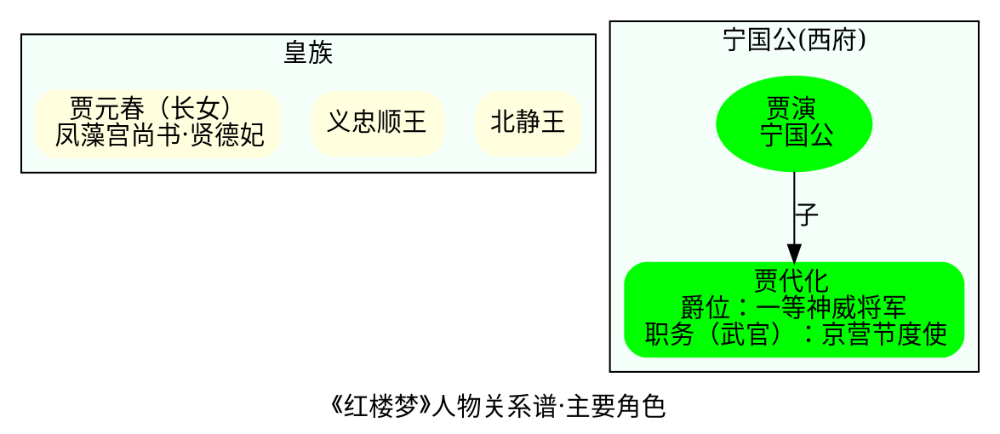

## 摘要
- 从 OmniGraffle 自动布局说起
- 背景知识：图论
- Graphviz 简介
- 最佳 Graphviz 实践(一)：流程图、数据结构图、网络路径 Trace Route
- 最佳 Graphviz 实践(二)：社会关系链分析（《红楼梦》、《权力的游戏》）
- 最佳 Graphviz 实践(三)：可视化函数调用、算法和数据结构可视化

<!--more-->

This article is part of an **Data Visualization** tutorial series. Make sure to check out my other articles as well:

- [数据可视化（一）思维利器 OmniGraffle 绘图指南 ](https://riboseyim.com/2017/09/15/Visualization-OmniGraffle/)
- [数据可视化（三）基于 Graphviz 实现程序化绘图](https://riboseyim.com/2017/09/15/Visualization-Graphviz/)
- [数据可视化（八）Program,Data and Classical Music](https://riboseyim.com/2018/12/16/Visualization-SocialNetwork/)

#### 前言

我之前的 [数据可视化（一）思维利器 OmniGraffle 绘图指南 ](https://riboseyim.com/2017/09/15/Visualization-OmniGraffle/)曾提到了力导图，在上文结尾还吐槽了一番自动布局按钮的坑。在本文中我力求将这个坑填上。

[OmniGraffle](https://riboseyim.github.io/2017/09/15/Visualization-OmniGraffle/) 生成自动布局图形的基础是 Graphviz 引擎。Graphviz（Graph Visualization Software）是一个由AT&T实验室启动的开源工具包，能够支持基于 [DOT 脚本，文件扩展名通常是 .gv 或 .dot ](#)的描述绘制图形。DOT 是一种文本图形描述语言，将生成的图形转换成多种输出格式的命令行工具，其输出格式包括PostScript，PDF，SVG，PNG，含注解的文本等。DOT 本身非常原始，提供了一种非常简单的描述图形的方法，同时意味着可以在命令行终端使用，或者被其它编程语言调用（Graphviz 就可以作为一个库使用）。这一点非常关键，基于 Graphviz 应用开发者不必掌握布局的复杂算法，而是可以把精力放在业务方面，将最后的图对象交给绘图引擎来处理即可。

有趣的是 Graphviz(Mac 版) 和 OmniGraffle 都曾获得[苹果设计奖 Apple Design Awards](#)。

在深入掌握 Graphviz 及其相关衍生应用之前，我们有必要了解一些基础理论 —— 图论(Graph theory)。

## 一、背景知识：图论(Graph theory)

- 柯尼斯堡七桥问题

东普鲁士柯尼斯堡（今日俄罗斯加里宁格勒）市区跨普列戈利亚河两岸，河中心有两个小岛。小岛与河的两岸有七条桥连接。在所有桥都只能走一遍的前提下，如何才能把这个地方所有的桥都走遍？


许多数学家都尝试去寻找这类问题的解决方案，后来发展成为了数学中的图论。图论史上第一篇重要文献是莱昂哈德·欧拉在1736年发表在圣彼得堡科学院的《柯尼斯堡的七桥》。该论文证明了柯尼斯堡七桥问题中，符合条件的走法并不存在，同时提出和解决了一笔画问题。过桥问题可以抽象简化为平面上的点与线组合，每一座桥视为一条线，桥所连接的地区视为点。从这个点出发的线有奇数条称为奇点，从这个点出发的线有偶数条称为偶点。任意一种河──桥图能否全部走一次的判定法则： 如果存在两个以上（不包括两个）奇顶点，路线不存在；且有n个奇顶点的图至少需要n/2笔画出。

#### 1、经典适用场景
- 路径问题（柯尼斯堡七桥问题），最小生成树问题，斯坦纳树
- 网络流与匹配问题：最大流问题，最小割问题，最大流最小割定理，最小费用最大流问题，二分图及任意图上的最大匹配，带权二分图的最大权匹配
- 覆盖问题：最大团、最大独立集、最小覆盖集、最小支配集

#### 2、经典算法
- 戴克斯特拉算法(D.A)
- 克鲁斯卡尔算法(K.A)
- 普里姆算法(P.A)
- 拓扑排序算法(TSA)
- 关键路径算法(CPA)
- 广度优先搜索算法(BFS)
- 深度优先搜索算法(DFS)

## 二、Graphviz 简明指南

#### 1、Graphviz 布局器

总的来说，Graphviz 支持两类图：无向图（graph,用“ - - ”表示节点之间）和 有向图（digraph,用“ ->” 表示节点之间）。顶点和边都具有各自的属性，比如形状，颜色，填充模式，字体，样式等。主要的布局器如下：

- dot: 默认布局方式，主要用于有向图(directed graphs)；
- neato：基于 sprint model 模型，又称force-based 或者 energy minimized；
- twopi：径向布局(radial layouts of graphs)，放射状；
- circo：圆环布局(circular layout of graphs)；
- fdp：无向图 (undirected graphs)；
- sfdp: large undirected graphs patchwork 、squarified tree maps osage 、
- dotty：一个用于可视化与修改图形的图形用户界面程序；
- lefty：一个可以显示 DOT 图形的可编程控件，并允许用户用鼠标在图上执行操作。

#### 2、Hello World!

```bash
$ brew install graphviz
$ dot -Tpng demo.dot -o demo.png
```

```
digraph demo{
  label="儿茶酚胺合成代谢路径";

  酪氨酸 -> L多巴 -> 多巴胺 -> 去甲肾上腺素 -> 肾上腺素;

  下丘脑 -> 多巴胺;
  交感神经元 -> 去甲肾上腺素;
  肾上腺髓质 -> 去甲肾上腺素,肾上腺素;

  酪氨酸 [label="酪氨酸",color=green];
  多巴胺 [label="多巴胺", color=red];
  肾上腺素 [label="肾上腺素", color=red];

  下丘脑 [shape=box];
  交感神经元 [shape=box];
  肾上腺髓质 [shape=box];
}
```


#### 3、twopi 径向布局

```bash
## 缺省为 dot 布局
$ dot -Kcirco -Tpng demo.dot -o demo.png
```


## 应用场景

#### 1、软件工程领域

软件工程领域的主要应用：

- 系统分析统一建模，时序图、用例图、类图、活动图、组件图、状态图、对象图等。
- 可视化函数调用、包依赖关系分析
- 可视化数据结构

基于 Graphviz 的开源项目 PlantUML 支持快速绘制各类 UML 图形。

```
@startuml
scale 600 width

[*] -> State1
State1 --> State2 : Succeeded
State1 --> [*] : Aborted
State2 --> State3 : Succeeded
State2 --> [*] : Aborted
state State3 {
  state "Accumulate Enough Data\nLong State Name" as long1
  long1 : Just a test
  [*] --> long1
  long1 --> long1 : New Data
  long1 --> ProcessData : Enough Data
}
State3 --> State3 : Failed
State3 --> [*] : Succeeded / Save Result
State3 --> [*] : Aborted

@enduml
```

Linux 内核内部结构非常复杂，从概念上就由五个主要的子系统构成：进程调度器模块、内存管理模块、虚拟文件系统、网络接口模块和进程间通信模块。这些模块之间通过函数调用和共享数据结构进行数据交互，在涉及内核版本、应用程序升级等场景中，弄清楚模块之间的依赖关系非常重要。

lsmod 命令用于显示已经加载到内核中的模块的状态信息，Used by表示依赖的内容。通过 lsmod 命令获取依赖信息之后，简单处理就可以转化为图形，而且图形生成的全过程可以由程序固化。

```bash
$ lsmod
Module          Used by
vboxdrv         vboxnetadp,vboxnetflt,vboxpci
nf_reject_ipv4  ipt_REJECT
ebtables        ebtable_filter
ip6_tables      ip6table_filter
ip6_udp_tunnel  vxlan
udp_tunnel      vxlan
xor             btrfs
raid6_pq        btrfs
nf_nat_masquerade_ipv4       ipt_MASQUERADE
xfrm_algo        xfrm_user
nf_defrag_ipv4        nf_conntrack_ipv4

......

```

```perl
digraph kernel{
        vboxdrv->vboxnetadp,vboxnetflt,vboxpci;
        nf_reject_ipv4->ipt_REJECT;
        ebtables->ebtable_filter;
        ip6_tables->ip6table_filter;
        ip6_udp_tunnel->vxlan;
        udp_tunnel->vxlan;
        xor->btrfs;
        raid6_pq->btrfs;
        nf_nat_masquerade_ipv4->ipt_MASQUERADE;
        xfrm_algo->xfrm_user;
        nf_defrag_ipv4->nf_conntrack_ipv4;

        ......
}
```


- [godag: Go项目代码静态依赖分析](https://github.com/legendtkl/godag)

#### 2、通信工程领域

- nwdiag 是一个基于 Python 的、支持 Dot 脚本生成网络图的库
- 结合 GIS 信息追踪网络路由


```bash
pip install nwdiag
nwdiag simple.diag
nwdiag -Tsvg simple.diag
```

```python
nwdiag {
  network dmz {
      address = "210.x.x.x/24"

      web01 [address = "210.x.x.1"];
      web02 [address = "210.x.x.2"];
  }
  network internal {
      address = "172.x.x.x/24";

      web01 [address = "172.x.x.1"];
      web02 [address = "172.x.x.2"];
      db01;
      db02;
  }
}
```


```
[root@li1437-101 ~]# traceroute www.google.com
traceroute to www.google.com (216.58.216.36), 30 hops max, 60 byte packets
 1  23.92.24.2 (23.92.24.2)  0.704 ms  0.736 ms 23.92.24.3 (23.92.24.3)  0.575 ms
 2  173.230.159.16 (173.230.159.16)  0.910 ms 173.230.159.14 (173.230.159.14)  2.265 ms
 		173.230.159.0 (173.230.159.0)  0.731 ms
 3  as15169.sfmix.org (206.197.187.50)  4.039 ms eqixsj-google-gige.google.com (206.223.116.21)  0.718 ms
 		as15169.sfmix.org (206.197.187.50)  3.944 ms
 4  108.170.242.227 (108.170.242.227)  4.902 ms
 		108.170.242.226 (108.170.242.226)  3.003 ms
 		108.170.243.2 (108.170.243.2)  3.064 ms
 5  216.239.47.37 (216.239.47.37)  4.836 ms 64.233.174.91 (64.233.174.91)  1.476 ms  1.447 ms
 6  216.239.54.22 (216.239.54.22)  12.464 ms  29.292 ms 64.233.174.204 (64.233.174.204)  9.032 ms
 7  209.85.245.172 (209.85.245.172)  10.633 ms
    108.170.230.130 (108.170.230.130)  20.010 ms
 		108.170.230.124 (108.170.230.124)  8.988 ms
10  lax02s22-in-f4.1e100.net (216.58.216.36)  10.358 ms  10.383 ms  10.301 ms
```

```go
digraph {
    label="Google Trace Sample";
    "23.92.24.2" [label="23.92.24.2 \n Fremont,California \n location:37.5670,-121.9829"] ;
    as15169 [label="as15169.sfmix.org \n San Francisco \n Metropolitan Internet Exchange"];
    "108.170.242.227" [label="108.170.242.227 \n California \n location:37.4192,-122.0574"];
    lax02s22 [label="ax02s22-in-f4.1e100.net \n Los_Angeles,California \n location:46.07305,-100.546"];
    "23.92.24.2" -> as15169 -> "108.170.242.227"  -> lax02s22;
}
```

#### 3、社会工程领域
- 决策树(Decision Tree)：人群鄙视链
- 复杂人物关系链分析（《红楼梦》、《权力的游戏》）


**注意: 如果需要使用分组（Group）特性，子图的名称必须以“cluster”开头，否则无法识别**




### Resources
- [Graphviz (dot) examples](https://renenyffenegger.ch/notes/tools/Graphviz/examples/index)
- [Introducing DataViz a data-structure visualization library for Golang](https://medium.com/@Arafat./introducing-dataviz-a-data-structure-visualization-library-for-golang-f6e60663bc9d)
- [memmap: Visualize Data Structures using Graphvi (Turns arbitrary data structures into more easily understood graphs.)](https://github.com/bradleyjkemp/memmap)
- [Python blockdiag](http://blockdiag.com/en/index.html)
- [Book《Eloquent JavaScript》| Written by Marijn Haverbeke](http://eloquentjavascript.net/16_canvas.html)

## 扩展阅读：数据可视化
- [数据可视化（一）思维利器 OmniGraffle 绘图指南 ](https://riboseyim.com/2017/09/15/Visualization-OmniGraffle/)
- [数据可视化（二）跑步应用Nike+ Running 和 Garmin Mobile 评测](https://riboseyim.com/2016/04/26/Visualization-BestAppMap)
- [数据可视化（三）基于 Graphviz 实现程序化绘图](https://riboseyim.com/2017/09/15/Visualization-Graphviz/)
- [数据可视化（四）开源地理信息技术简史（Geographic Information System](https://riboseyim.com/2017/05/12/Visualization-GIS/)
- [数据可视化（五）基于网络爬虫制作可视化图表](https://riboseyim.com/2017/05/12/Visualization-Charts/)
- [数据可视化（六）常见的数据可视化仪表盘(DashBoard)](https://riboseyim.com/2017/11/23/Visualization-DashBoard/)
- [数据可视化（七）Graphite 体系结构详解](https://riboseyim.com/2017/12/04/Visualization-Graphite/)
- [数据可视化（八）Program,Data and Classical Music](https://riboseyim.com/2018/12/16/Visualization-SocialNetwork/)
- [数据可视化（十）公共数据源列表](https://riboseyim.com/2018/01/15/Visualization-DataSource/)

## 参考文献
- [Article:Grphviz and Dynagraph -- Static and Dynamic Graph Drawing Tools | 2004](https://www.researchgate.net/publication/216633938_Graphviz_and_Dynagraph_--_Static_and_Dynamic_Graph_Drawing_Tools?enrichId=rgreq-a202987690a5ed5bd3960ba1691b80e8-XXX&enrichSource=Y292ZXJQYWdlOzIxNjYzMzkzODtBUzoxMDQ2MTMzODI0NTk0MDJAMTQwMTk1MzE4MzExNA%3D%3D&el=1_x_2&_esc=publicationCoverPdf)
- Emden Gansner (Google Inc.)
- Stephen C. North (Infovisible)
- Eleftherios Koutsofios (AT&T)
- Emden Gansner (AT&T Labs - Research)
- [Graph Drawing by High-Dimensional Embedding | David Harel 《Journal of Graph Algorithms and Applications》](http://www.emis.de/journals/JGAA/accepted/2004/HarelKoren2004.8.2.pdf)
- [dotguide: Drawing graphs with dot | January 5,2015](http://www.graphviz.org/pdf/dotguide.pdf)
- [用 Graphviz 可视化函数调用 | IBM developerworks ,2005](https://www.ibm.com/developerworks/cn/linux/l-graphvis/)
- [邱俊涛：使用graphviz绘制流程图（2015版）](http://abruzzi.github.com/2015/11/using-graphviz-drawing/)
- [周志华《机器学习》习题解答：Ch4.3 - 编程实现ID3算法](https://py131.github.io/2017/04/03/%E5%91%A8%E5%BF%97%E5%8D%8E%E3%80%8A%E6%9C%BA%E5%99%A8%E5%AD%A6%E4%B9%A0%E3%80%8B%E4%B9%A0%E9%A2%98%E8%A7%A3%E7%AD%94/%E5%91%A8%E5%BF%97%E5%8D%8E%E3%80%8A%E6%9C%BA%E5%99%A8%E5%AD%A6%E4%B9%A0%E3%80%8B%E4%B9%A0%E9%A2%98%E8%A7%A3%E7%AD%94%EF%BC%9ACh4.3%20-%20%E7%BC%96%E7%A8%8B%E5%AE%9E%E7%8E%B0ID3%E7%AE%97%E6%B3%95/)
- [机器学习算法实践-决策树(Decision Tree)](http://python.jobbole.com/87994/)
- [Sike:UML绘制-dot语言](https://segmentfault.com/a/1190000004646829)
- [类似Graphviz的工具是如何实现自动排版的？ | 知乎](https://www.zhihu.com/question/32098665)
- [你在鄙视链的哪一层？](http://www.managershare.com/post/222620)
- [扒完社交网络关系才明白，《权力的游戏》凭什么是神作 | EGO影视荟](https://mp.weixin.qq.com/s?__biz=MzA4NTU2MTg3MQ==&mid=2655161061&idx=1&sn=6b1e046d152397ace5769ec70c1df76e&chksm=84602d85b317a493c4b25aa3681029fa6f2ccf3f328c9ee2a538f6d4e849465267ed12a8c116&mpshare=1&scene=1&srcid=0910QR98pyrCcNyEcbfwfkRe%23rd)
