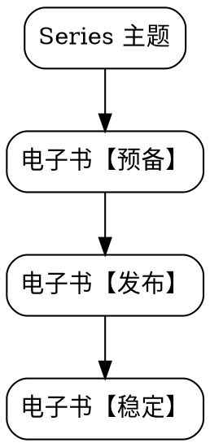

## 摘要
- 写作这门手艺
- 写作工具链
- 读者社区运营
- 写作与职业发展

<!--more-->

## 写作这门手艺

#### 不忘初心
- [最佳写作实践：从Evernote到Ulysses](https://riboseyim.github.io/2016/06/11/Writing/)

#### 写作工具链

- [我的写作工具链](https://riboseyim.com/2017/06/03/Writing-WriterToolChain/)
- [数据可视化（一）思维利器 OmniGraffle 绘图指南 ](https://riboseyim.github.io/2017/09/15/Visualization-OmniGraffle/)

#### 读者社区运营
- [| >>>>> 读者反馈问题汇编 <<<<<< |](https://riboseyim.github.io/2017/07/05/Writing-Reader-Question/)
- [基于用户需求和最大传播效果为目标的内容创作](https://riboseyim.github.io/2017/04/10/Writing-MediaData/)

#### 写作与职业发展
- [技术写作与出版](https://riboseyim.github.io/2017/10/22/Writing-Technology/)
- [Uber 技术团队中的作家](https://riboseyim.com/2018/12/02/Writing-Technical/)

## 产品孵化

#### 一般路径

## My eBooks

#### [《The Linux Perf Master》](https://riboseyim.com/2017/12/21/eBook-LPM/)

- [riboseyim.gitbook.io](https://riboseyim.gitbook.io/perf)
- [Edition 0.4 20180714 【百度云盘 pdf、mobi、ePub】 ](https://pan.baidu.com/s/1C20TAKtYxXeRkTjNy43WOQ)
- [legacy.gitbook.com](https://www.gitbook.com/book/riboseyim/linux-perf-master)

## 孵化器资源池

#### 工程师的自我修养

- Level:Series
- [工程师的自我修养：全英文技术学习实践](https://riboseyim.com/2017/06/27/Technology-English/)
- [软件工程实践中的十大法则](https://riboseyim.com/2017/07/05/Law-Of-Engineering/)

#### 工具癖

- Level:Series

#### 数据可视化
- Level:eBook
- [数据可视化（一）思维利器 OmniGraffle 绘图指南 ](https://riboseyim.com/2017/09/15/Visualization-OmniGraffle/)
- [数据可视化（二）跑步应用Nike+ Running 和 Garmin Mobile 评测](https://riboseyim.com/2016/04/26/Visualization-BestAppMap)
- [数据可视化（三）基于 Graphviz 实现程序化绘图](https://riboseyim.com/2017/09/15/Visualization-Graphviz/)
- [数据可视化（四）开源地理信息技术简史（Geographic Information System](https://riboseyim.com/2017/05/12/Visualization-GIS/)
- [数据可视化（五）基于网络爬虫制作可视化图表](https://riboseyim.com/2017/05/12/Visualization-Charts/)
- [数据可视化（六）常见的数据可视化仪表盘(DashBoard)](https://riboseyim.com/2017/11/23/Visualization-DashBoard/)
- [数据可视化（七）Graphite 体系结构详解](https://riboseyim.com/2017/12/04/Visualization-Graphite/)
- [数据可视化（八）Program,Data and Classical Music](https://riboseyim.com/2018/12/16/Visualization-SocialNetwork/)
- [数据可视化（十）公共数据源列表](https://riboseyim.com/2018/01/15/Visualization-DataSource/)

## History
- [Night News 20181201 | 上线一个纯洁的域名](http://riboseyim.github.io/2018/12/01/News-Night-20181201/)

## 参考文献
